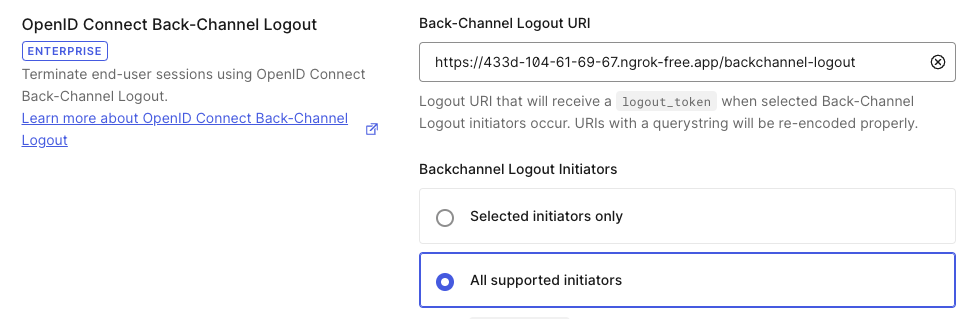

# Customer Identity with OAuth2 and OIDC<br>Lab 02 - Federated Identity

## Overview

This lab explored two areas of multiple applications sharing the same federated identity provider.

In part one the second application, Treasure, is configured with the IdP.
All that is necessary is to configure the .env file for both applications: ./src/pyrates and ./src/treasure.

The second part explores the OIDC Back-Channel Logout to let all the applications in a group
know that the user has signed out of the IdP.
This part is optional.
For the back-channel logout to work, the local sandbox must be exposed with an address on the Internet and
for this lab that requires a free (or paid) account at https://ngrok.com.
Also, it will only work in a trial (before it expires) or enterprise Auth0 tenant,
because those are the only tenants that have the feature enabled.

FYI: backc-channel logout uses a direct call from the IdP to an application endpoint, it does not use
a browser redirect.
So, it only works with regular web applications, which are "confidential clients" running on a web server.
There simply is not any way for the IdP to contact single-page or native applications to tell them the user has signed out.

## Lab Overview

This hands-on lab depends on:
* Auth0 administrative account and a development tenant
* Visual Studio Code, current edition
* Node.js >=v20.0.0
* Web browser (the lab is tested with Chrome)

Part two depends on:
* A free (or paid) account at https://ngrok.com
* A trial or enterprise Auth0 tenant with OIDC Back-Channel Logout available

The full instructions for this lab are provided in the course book.
This is an overview of what is accomplished in the lab:

### Part 1 - Federated Identity and Single Sign-On

### Prerequisites

1. Completion of the Pyrates application integration in *Lab 01 - Identity Provider*.

#### 1.1 - Configure and launch the Pyrates application
1. Configure the ./src/pyrates/.env file: Use the information from the Pyrates application integration to set the
ISSUER_BASE_URL, CLIENT_ID, and CLIENT_SECRET from the Pyrates application integration in your Auth0 tenant.
Remember that the ISSUER_BASE_URL is created by prepending https:/ to the *Domain*.
1. Open a new integrated terminal window in the project folder and launch the Pyrates application with *npm run start-pyrates*.
Hint: right click on the Lab_02 folder and pick "Open in integrated terminal".
1. Open a browser window to http://localhost:3000 and make sure the application runs as in Lab 01.

#### 1.2 - Configure the Treasure application
1. Create a new web application integration for *Treasure*; use http://localhost:3001 for the application callback URL.
1. Configure the ./src/treasure/.env file with the information from the new integration.
1. Test the two applications; use *npm run test-pyrates* or *npm run test-pyrates-coverage* and *npm run test-treasure* or *npm run test-treasure-coverage* to test the applications separately.
Use *npm test* or *npm run test-coverage* to test both applications.

#### 1.3 - Launch and check the applications
1. Open a new integrated terminal window in the project folder and launch the Treasure application with *npm run start-treasure*.
1. In the browser, click the *Profile* link to view the user information.
If you are not currently signed on you will have to authenticate.
1. Click the *Treasure* link; notice this takes you to the second application at the other URL.
You will not have to authenticate again for this application, since the IdP already knows who you are!
1. FYI: The sign out link for pyrates and treasure will only sign the user out of the IdP for the individual application,
back-channel logout (part two) is required for the links to work across the applications.

#### 1.4 - Shut it down

1. Terminate (ctrl-C) each application in each terminal window.

### Part 2 - OIDC Back-Channel Logout

Note: there are no automated tests for this part because all that would be tested is configuration, and
it would interfere with the tests for part one if part two is not completed.

#### Prerequisites

1. A trial or enterprise Auth0 tenant (with back-channel logout enabled).
    
#### 2.1 - ngrok
1. Sign in to ngrok.com. ; if you do not have an account click the "Sign Up" button at https://ngrok.com and register
for a free account.
1. Update the ngrok.yml file in the project folder with your authtoken from ngrok.
1. Open a third terminal window in the project folder.
1. Launch ngrok with *npm run start-ngrok*, and make a note of the two public URLs:
one for pyrates at port 3000, and the other for treasure at port 3001.
Leave ngrok running in this terminal window, it is OK to run even if the applications are not active.
The URLs will change if you restart ngrok.

#### 2.2 - Reconfigure the emvironments and test
1. Update the .env files for each application replacing the local URLs with the corresponding public URLs from ngrok.
1. In the Auth0 integrations for Pyrates and Treasure add (do not replace) the allowed
callback and logout URLs with the public URLs;
do not forget to append /callback for the callback URLs.
1. In the original terminal windows restart the Pyrates and Treasure applications.
1. Manully test as in part one to make sure the applications work with the new URLs.

#### 2.3 - Update the Pyrates application

1. Open a fourth integrated terminal in the project folder.
1. Use *npm install express-session* to install the Express session manager; the back-channel logout requires a session on the server.
1. Use *npm install memorystore* to install a memory store for the session to share with express-openid-connect.
1. In ./src/pyrates/homeController.js import the session and the memorystore:
    ```js
    import session from 'express-session'
    import initMemoryStore from 'memorystore'
    ```
1. After the comment about the session following the assignment of the view engine create a new session store
instance.
This looks funky, because the import of the memory store is actually a function that needs to be
passed the session, and it returns a constructor to make the new session store:
    ```js
    const sessionStore = new (initMemoryStore(session))({ checkPeriod: 86400000 })
    ```
1. Now we can add a variable with the middleware for the session manager, and add it to Express:
    ```js
    const sessionMiddleware = session({
        secret: secret,
        resave: true,
        saveUninitialized: true,
        store: sessionStore
    })

    app.use(sessionMiddleware)
    ```
1. Finally tweak the configuration for the authentication middleware to enable back-channel logout by adding:
    ```js
    backchannelLogout: { store: sessionStore }
    ```
1. Save the file.

#### 2.4 - Update the Treasure application
1. Repeat all of the steps to update the Pyrates application in step three for the Treasure application.
1. One additional configuration: add the routes attribute to the authentication configuration to send
the user back to Pyrates when they sign out of Treasure:
    ```js
    routes: {
        postLogoutRedirect: pyratesUrl
    },
    ```
1. Save the file.

#### 2.5 - Update the application integrations
1. In the Auth0 application integration for Pyrates, on the *Settings* tab, locate the section for
*OpenID Cconnect Back-Channel Logout*:

    
1. Set the URI to the public URL for Pyrates with /backchannel-logout appended.
1. Pick "All supported initiators".
1. Save the configuration.
1. Repeat these steps for the Treasure application, subsitituing the public Treasure URL.

#### 2.6 - Test the application.

1. The Nodemon utility should have restarted both Pyrates and Treasure as we save the controller code;
if it did not or you are not sure, restart both applications.
1. Visit the Pyrates application at the public URL.
1. Click on the profile page and sign on.
1. Click the Treasure link and make sure you land on that application.
1. Click the sign out link at the Treasure application.
Make sure you return to Pyrates, and are no longer logged in!

#### 2.7

1. Shut down (ctrl-C) both applications and ngrok in the first three terminal windows.
1. Close all of the terminal windows.

## License

The project is distributed under the MIT license. You may use and modify all or part of it as you choose, as long as attribution to the source is provided per the license. See the details in the [license file](./LICENSE.md) or at the [Open Source Initiative](https://opensource.org/licenses/MIT).


<hr>
Copyright © 2024 Joel A Mussman and NextStep IT Training powered by Smallrock. All rights reserved.

Antique Pirate Ship image by Digikhmer Photography is licensed for from Dreamscape: ID 60148066 © Digikhmer | Dreamstime.com